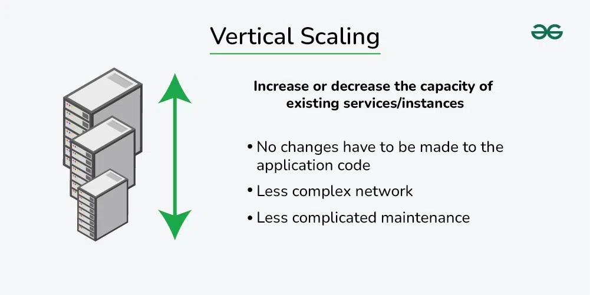
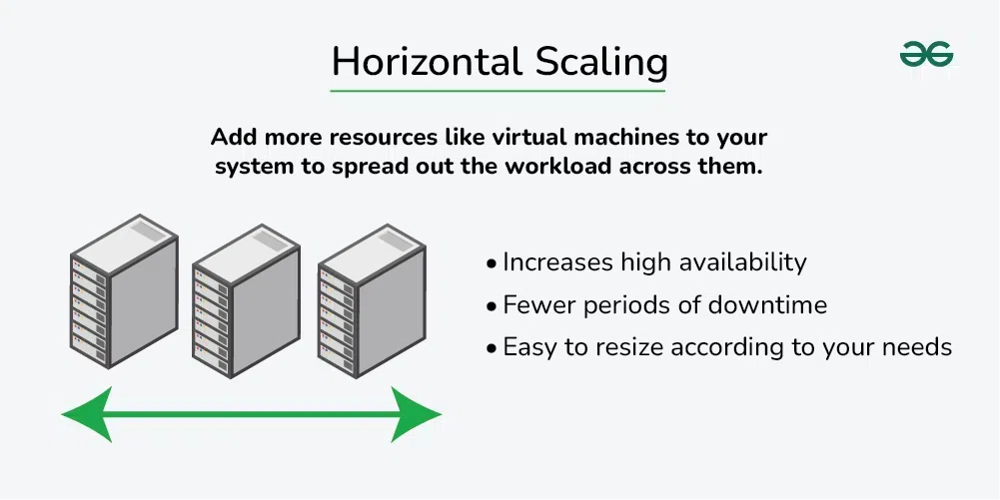

# What is Scalability?

Scalability is the capacity of a system to support growth or to manage an increasing volume of work.

When a system’s workload or scope rises, it should be able to maintain or even improve its performance, efficiency, and dependability. This is known as **scalability**.  
A system must be scalable in order to accommodate growing user traffic, data volumes, or computing demands without suffering a major performance hit or necessitating a total redesign.

## Importance of Scalability in System Design

Scalability is an important factor in system design, offering many benefits such as:

- **Managing Growth:** A scalable system can handle more users, data, and traffic without sacrificing speed or reliability.
- **Increasing Performance:** By distributing the load among multiple servers or resources, scalability enhances processing speed, response time, and user experience.
- **Ensuring Availability:** Systems remain operational even during unexpected spikes in traffic or component failures.
- **Cost-effectiveness:** Scalable systems adjust resources dynamically, avoiding unnecessary expenses.
- **Encouraging Innovation:** Scalability removes infrastructure barriers, allowing businesses to adapt quickly to market changes.

---

# How to Achieve Scalability?

Scalability is achieved through two primary methods:

## 1. Vertical Scaling (Scale-Up)

**Vertical scaling** refers to increasing the capacity of an individual machine by upgrading its hardware components such as **CPU, RAM, or storage**.

### Example of Vertical Scaling:

A web application runs on a server with **4 CPU cores and 8GB RAM**. As traffic grows, the server struggles. To handle the load, the server is upgraded to **8 CPU cores and 16GB RAM**.

### ✅ Advantages:

- **Increased Capacity** – Upgrading hardware boosts performance.
- **Simplified Management** – Easier to implement since only one machine is modified.

### ❌ Disadvantages:

- **Limited Scalability** – Restricted by the maximum hardware capacity of a single server.
- **Increased Costs** – High-end hardware upgrades can be expensive.
- **Single Point of Failure** – If the server fails, the entire system is affected.

## 

## 2. Horizontal Scaling (Scale-Out)

**Horizontal scaling** involves adding more servers or machines to a system to distribute the workload across multiple units.

### Example of Horizontal Scaling:

A delivery company initially operates with **one van**. As demand increases, instead of upgrading the van, the company adds **multiple vans and drivers**, distributing deliveries across them.

### ✅ Advantages:

- **Expanded Capacity** – More servers can handle a larger workload.
- **Enhanced Performance** – Load balancing ensures smooth processing.
- **Greater Fault Tolerance** – If one server fails, others take over.

### ❌ Disadvantages:

- **Increased Complexity** – Managing multiple servers requires additional infrastructure.
- **Higher Costs** – More servers mean increased hardware and maintenance costs.
  

---

# Vertical Scaling vs. Horizontal Scaling

| **Aspect**             | **Vertical Scaling (Scale-Up)**      | **Horizontal Scaling (Scale-Out)**                             |
| ---------------------- | ------------------------------------ | -------------------------------------------------------------- |
| **Definition**         | Upgrading a single machine           | Adding more machines to the system                             |
| **Cost**               | Expensive hardware upgrades          | Lower per server, but overall cost increases with more servers |
| **Complexity**         | Easier to implement                  | More complex to manage multiple instances                      |
| **Limitations**        | Limited by hardware capacity         | Can scale infinitely with more servers                         |
| **Performance Impact** | Improves by adding resources         | Improves by distributing load across servers                   |
| **Downtime**           | May require downtime for upgrades    | Can be scaled without downtime                                 |
| **Use Case**           | Small applications with less traffic | Large-scale, high-traffic applications                         |
| **Elasticity**         | Less flexible, harder to adjust      | Highly elastic, easy to add/remove servers                     |

---

# Factors Affecting Scalability

Several factors influence a system's ability to scale:

- **Performance Bottlenecks:** Slow queries, inefficient algorithms, or resource constraints.
- **Resource Utilization:** Efficient CPU, memory, and storage management.
- **Network Latency:** Delays in data transmission impact scalability.
- **Data Storage and Access:** Scalable solutions like distributed databases improve performance.
- **Concurrency and Parallelism:** Processing multiple tasks simultaneously increases efficiency.
- **System Architecture:** Modular, loosely coupled architectures scale better.

---

# Components that Enhance Scalability

Key components that improve scalability include:

- **Load Balancer:** Distributes incoming traffic evenly across servers.
- **Caching:** Reduces database queries by storing frequently accessed data.
- **Database Replication:** Copies data across multiple locations for improved availability.
- **Database Sharding:** Splits databases into smaller, more manageable units.
- **Microservices Architecture:** Decouples services for independent scaling.
- **Data Partitioning:** Distributes data across multiple storage devices.
- **Content Delivery Networks (CDNs):** Reduces latency by caching content closer to users.
- **Queueing Systems:** Handles traffic spikes asynchronously.

---

# Real-World Examples of Scalable Systems

1. **Google** – Uses distributed systems (Bigtable, MapReduce, Spanner) to handle billions of search queries.
2. **Amazon Web Services (AWS)** – Provides elastic cloud computing resources that scale dynamically.
3. **Netflix** – Uses microservices and caching to deliver high-quality streaming content globally.

---

# Challenges and Trade-offs in Scalability

- **Cost vs. Scalability:** Scaling increases performance but raises infrastructure costs.
- **Complexity:** More components mean higher maintenance and operational challenges.
- **Latency vs. Throughput:** Balancing fast response times with high data processing rates.
- **Data Partitioning Trade-offs:** Choosing the right partitioning strategy to optimize storage and retrieval.

---

# Conclusion

Scalability is essential for modern system design, enabling businesses to **handle increased traffic, data, and workloads efficiently**. Achieving scalability involves **vertical scaling (scaling up) and horizontal scaling (scaling out)**, along with **distributed architectures and smart resource management**.

By focusing on **scalable design principles**, companies can **grow sustainably, optimize performance, and ensure high availability** for their users.
